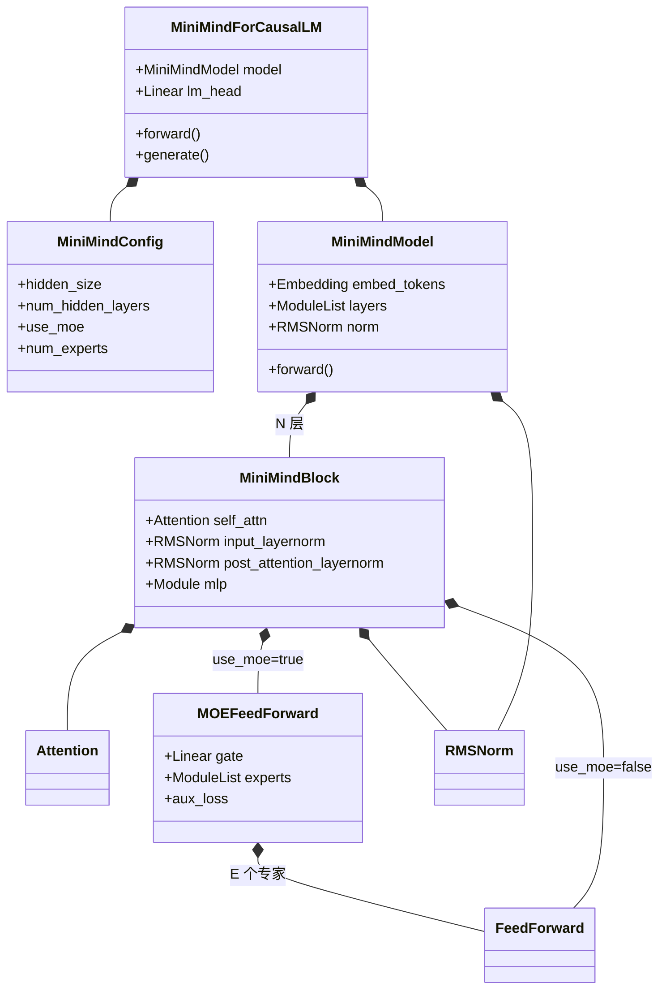
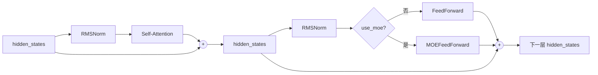
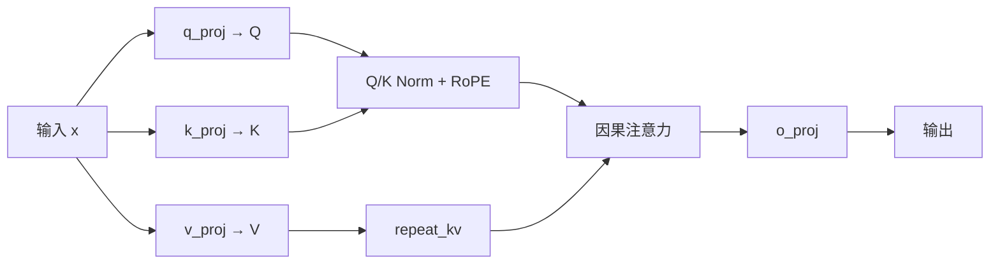
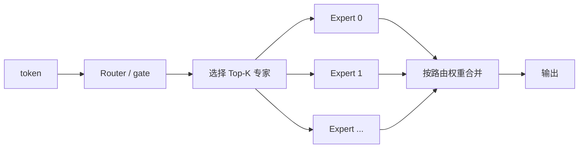
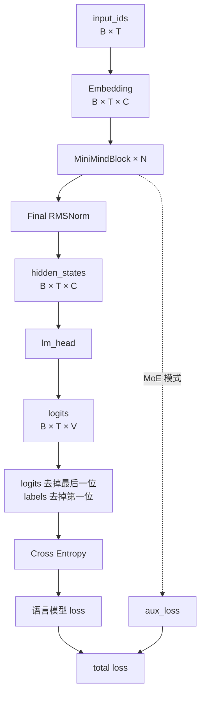

# MiniMind 模型类分析

> 源码入口：[`model/model_minimind.py`](../model/model_minimind.py)

MiniMind 按“基础组件 → Transformer 层 → 模型主干 → 语言模型外壳”逐层组装：

```text
RMSNorm / RoPE / Attention / FFN
                ↓
          MiniMindBlock
                ↓ × N 层
          MiniMindModel
                ↓ + lm_head
       MiniMindForCausalLM
```

## 1. 类的整体关系



这里主要是**组成关系**：例如 `MiniMindModel` 内部包含多个 `MiniMindBlock`，并不是继承它们。

## 2. 各类职责

| 类 | 作用 | 输入 → 输出 |
|---|---|---|
| `MiniMindConfig` | 保存层数、隐藏维度、注意力头数、MoE 参数等配置 | 不处理张量 |
| `RMSNorm` | 稳定特征数值，形状不变 | `[B,T,C] → [B,T,C]` |
| `Attention` | 让 token 读取当前及之前 token 的信息 | `[B,T,C] → [B,T,C]` |
| `FeedForward` | 每个 token 独立进行非线性特征变换 | `[B,T,C] → [B,T,C]` |
| `MOEFeedForward` | Router 为 token 选择少量 FFN 专家，并产生负载均衡损失 | `[B,T,C] → [B,T,C]` |
| `MiniMindBlock` | 组合 Attention、FFN/MoE、归一化和残差连接 | `[B,T,C] → [B,T,C]` |
| `MiniMindModel` | Embedding + N 个 Block + 最终归一化，形成模型主干 | `[B,T] → [B,T,C]` |
| `MiniMindForCausalLM` | 主干 + `lm_head` + 语言模型 loss + 文本生成 | `[B,T] → [B,T,V]` |

符号含义：`B` 为 batch size，`T` 为序列长度，`C` 为隐藏维度，`V` 为词表大小。

## 3. 一个 Transformer Block



对应核心代码：

```python
hidden_states = hidden_states + self.self_attn(
    self.input_layernorm(hidden_states), ...
)[0]

hidden_states = hidden_states + self.mlp(
    self.post_attention_layernorm(hidden_states)
)
```

这是 **Pre-Norm + 残差连接**：先归一化，再经过子模块，最后和原输入相加。

## 4. Attention 内部

默认配置为 8 个 Query 头、4 个 Key/Value 头，因此属于 GQA：



以默认 `C=768` 为例：

```text
输入： [B,T,768]
Q：    [B,T,8,96]
K/V：  [B,T,4,96]
       ↓ repeat_kv
K/V：  [B,T,8,96]
输出： [B,T,768]
```

- `precompute_freqs_cis()`：预计算 RoPE 的正余弦值。
- `apply_rotary_pos_emb()`：给 Q、K 加入位置信息。
- `repeat_kv()`：复制 K/V 头，使其数量与 Query 头匹配。
- 因果掩码确保当前位置不能看到未来 token。

## 5. 普通 FFN 与 MoE

### 普通 FFN

所有 token 共享同一个前馈网络：

```text
x ─┬→ gate_proj → SiLU ─┐
   └→ up_proj ──────────×→ down_proj → output
```

计算形式：

```python
down_proj(silu(gate_proj(x)) * up_proj(x))
```

### MoE FFN

`MOEFeedForward` 内部包含多个 `FeedForward` 专家：



默认有 4 个专家，每个 token 选择 1 个。`aux_loss` 用来防止 Router 长期只选择少数专家：

```text
总训练损失 = 语言模型 loss + MoE 负载均衡 loss
```

## 6. 完整前向传播



训练脚本调用：

```python
res = model(input_ids, labels=labels)
loss = res.loss + res.aux_loss
```

此处训练脚本中的 `model` 是 `MiniMindForCausalLM`；它内部的 `self.model` 才是 `MiniMindModel` 主干。

## 7. 训练与生成的边界

| 路径 | 入口 | 主要行为 |
|---|---|---|
| 训练 | `MiniMindForCausalLM.forward()` | 一次处理整个序列，计算 logits、主 loss 和 MoE loss |
| 生成 | `MiniMindForCausalLM.generate()` | 循环调用 `forward()`，每次选出一个新 token，并复用 KV Cache |

`embed_tokens.weight` 默认与 `lm_head.weight` 共享：输入端负责“查 token 向量”，输出端负责“预测下一个 token”，但使用同一份参数以减少模型规模。

## 8. 一句话记忆

> `Config` 管配置；`Attention` 负责 token 间通信；`FFN/MoE` 负责单个 token 的特征变换；`Block` 组合二者；`MiniMindModel` 堆叠 Block；`MiniMindForCausalLM` 再加入词表预测头、loss 和生成能力。
